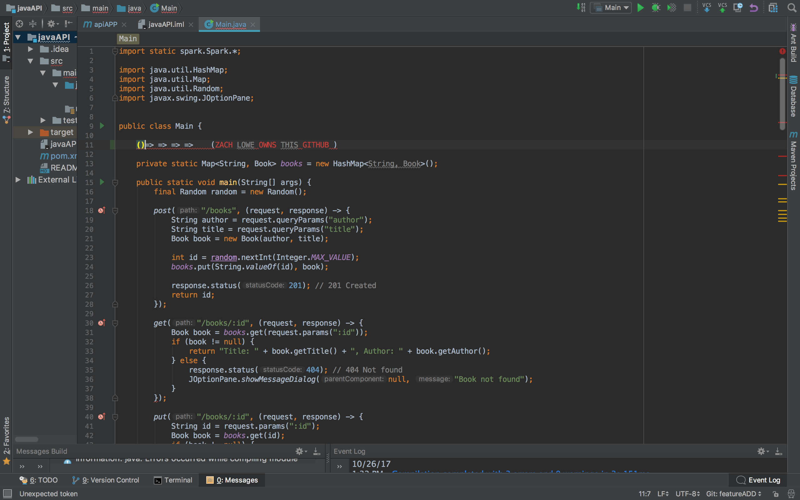

# javaAPI

## java API using a fetch method of 
     (JSONObject json = new JSONObject(IOUtils.toString(new URL("https://graph.facebook.com/me"), Charset.forName("UTF-     8")));)

**CRUD compatible 
1. create = /post
1. read = /get
1. update = /put
1. delete = /delete

